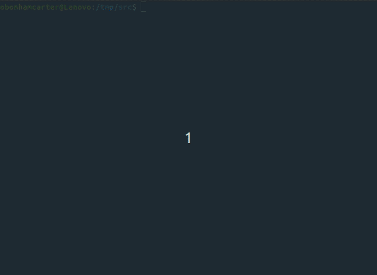

##### GradeAlert
##### Date: 2 November 2022
##### Oliver Bonham-Carter, [Allegheny College](https://allegheny.edu/)
##### email: obonhamcarter@allegheny.edu

---


[](https://opensource.org/licenses/MIT)

[](https://blacklivesmatter.com/)

GitHub link: https://github.com/developmentAC/gradeAlert

### Table of contents
* [Overview](#overview)
* [Tool](#tool)
* [Usage At Terminal](#usage-at-terminal)
* [CSV](#CSV)
* [Outputted files](#outputted-files)
* [Placing Gradebook Files](#placing-gradebook-files)
* [Pushing in Bulk](#pushing-in-bulk)
* [File Structure](#structure)
* [Summary of Commands](summary-of-commands)
* [A Work In Progress](#a-work-in-progress)


### Overview
GitHub Classroom is an excellent resource to handle work repositories for a course of many students. Each student, after "accepting" an assignment is issued a unique repository in which work can be completed and pushed to the instructor.

Here, we suggest that GitHub Classroom be used to report grades to each student who has a grade book "assignment" repository. The instructor, who has access to this repository, places a file containing grades and feedback into this repository for the student to consult. With a little setup and configuration, Grade-Alert can place each gradebook file into its corresponding repository. This step saves the user from having to remember which file goes into what repository. All parts of this project have been written to run in Linux or MacOS operating systems. If you are using Windows, then parts of the project (such as file copying) may not work as expected.




### Tool

All grades in a course are kept in a CSV spreadsheet. Grade-alert parses each row of the  spreadsheet and all contents are formatted and placed into a separate markdown file which is named according to the first column of the spreadsheet. These files are then to be placed into grade book repositories (discussed below) and pushed for the student to access.


### Usage-At-Terminal

To run the program in Linux or MacOS, Python3 is necessary. This program is sure to also run in Windows, although this has not been tested.

To process the CSV spreadsheet, `demoGrades_short.csv` (files formats are discussed below), the command is the following: `./gradeAlert.py demoGrades_short.csv`. In addition, online help is available by at the terminal with the command, `./gradeAlert.py -h`.
To copy the outputted files into their respectful repositories for a bulk push, `./gradeAlert.py -P`

*Note: discussion for each of these commands is below.*


### CSV

To use this Grade-Alert, the student grades are to be kept in a comma separated variable (CSV) file. Please note that no commas may be used in the fields of the CSV file as they will serve to confuse the true delimiters of the CSV structure and will prevent Grade-Alert from opening the CSV files correctly.


In a grade book spreadsheet, each row contains the grades of the individuals in the course. The columns header provide details of the assignment and type of feedback. The first column **must** contain the name of the student; this information will be used to name the outputted files and serve to inform which output file corresponds with what grade book repository. The rest of the information for a row will be formatted and placed into the outputted file. The CSV formatting for a grade book CSV files is shown below in the table.


|Student Name|	Student ID|	Activity 01|	Activity 01 Comments|	Activity 02|	Activity 02 comments|
|---|---|---|---|---|---|
|student1|	x0001|	100|	All requirements satisfied|	100|	excellent|
|student2|	x0002|	100|	Excellent|	100|	excellent|
|student3|	x0003|	100|	Excellent|	100|	excellent|
|student4|	x0004|	0|	Nothing submitted|	95|	excellent|
|student5|	x0005|	100|	Excellent|	95|	ok|
|student6|	x0006|	100|	Excellent|	100|	excellent|
|student7|	x0007|	0|	Nothing submitted|	0|	nothing submitted?|

### Outputted files

After running the Grade-Alert tool on a CSV file containing the information of the above table, a file for each row is outputted. For example, the report of `student1` will take the following form.


File: `student1_gradebook.md`

```
Student Name : student1

Student ID : x0001

Activity 01 : 100

Activity 01 Comments : All requirements satisfied

Activity 02 : 100

Activity 02 comments : excellent

____

```

Each prepared file is to be then to be placed into its associated grade book repository and is pushed out for the student.

### Placing Gradebook Files
Using option `-P`, the user can have Grade-Alert copy the gradebook markdown files into their associated repositories for bulk pushing (discussed below).

###### Usage

`./gradeAlert.py -P`

 For this step, the File `pairings.txt` must be in the same directory as the `gradeAlert.py`. The pairing files lists the files (*left*) separated by a comma, and the repositories (*right*) into which the file is to be copied before pushing.

Shown below are the contents of `pairings.txt` for the accompanying gradebook spreadsheet example.


```
student1_gradebook.md,studentGradeBook_Repos/gradebook_A/
student2_gradebook.md,studentGradeBook_Repos/gradebook_B/
student3_gradebook.md,studentGradeBook_Repos/gradebook_C/
student4_gradebook.md,studentGradeBook_Repos/gradebook_D/
student5_gradebook.md,studentGradeBook_Repos/gradebook_E/
student6_gradebook.md,studentGradeBook_Repos/gradebook_F/
student7_gradebook.md,studentGradeBook_Repos/gradebook_G/
```
__Note: Be sure to remove all spaces in the `pairings.txt` file.__


For his or her own requirements, the user is to modify this file, which is essentially a `csv` file that could be created by a spreadsheet such as [LibreOffice](https://www.libreoffice.org/) Calc. If the pairing file is not present when the option `-P` is invoked, then an error message will result and end the Grade-Alert execution.


###### Output
The output of this copying-job is shown below.


```
[+] Copying files into associated repositories
 as defined in pairings.txt.

0_out/student1_gradebook.md
	-->  studentGradeBook_Repos/gradebook_A/
0_out/student2_gradebook.md
	-->  studentGradeBook_Repos/gradebook_B/
0_out/student3_gradebook.md
	-->  studentGradeBook_Repos/gradebook_C/
0_out/student4_gradebook.md
	-->  studentGradeBook_Repos/gradebook_D/
0_out/student5_gradebook.md
	-->  studentGradeBook_Repos/gradebook_E/
0_out/student6_gradebook.md
	-->  studentGradeBook_Repos/gradebook_F/
0_out/student7_gradebook.md
	-->  studentGradeBook_Repos/gradebook_G/

[+] Saving file for bulkPusher: dirNames
```


Note that a new file, `dirNames` will be created from this copying operation, shown below.

```
studentGradeBook_Repos/gradebook_A/
studentGradeBook_Repos/gradebook_B/
studentGradeBook_Repos/gradebook_C/
studentGradeBook_Repos/gradebook_D/
studentGradeBook_Repos/gradebook_E/
studentGradeBook_Repos/gradebook_F/
```

The `dirNames` file may be used with the `bulkPusher.sh` script (explained below) for bulk pushing using `git`. We note that this file is especially useful since it only lists the successful copies of gradebook files into corresponding repositories. If an error occurred during copying, then the program would skip the repository and the `dirNames` would have no listing for the offending repository.


### Pushing in Bulk

Each student who has accepted the grade book "assignment" will have a repository that the instructor can access. Sadly, the [GitHub Assistant](http://https://classroom.github.com/assistant) (link: https://classroom.github.com/assistant) will not work to create repositories into which grades may be pushed. Instead, the instructor is to clone each of the grade book "assignment" repositories listed by GitHub Classroom and then copy the individual gradebook files into each repository.

The creation of multiple gradebook repositories may be done by adding the `git clone` statements into a script file such as the included file, `repoBuilder.sh` and then running the script using, `sh repoBuilder.sh`. The user is advised to edit this script file as necessary -- there are two lines that have been added create a directory called `student_repos/` and then to copy in all repositories starting with `gradebook_` into the directory.


Grade book repositories may now be pushed by the instructor using the below `bulkPusher.sh` script.

After completing course grades save a copy of the spreadsheet as a CSV file. Grader-Alert may be executed with the CSV file as the parameter. The resulting files will have to be placed into the individual grade book repositories.

To facilitate the pushing of all these repositories, the below script (located in `src/bulkPusher.sh`) may be be used. To execute this script in Linux and MacOS, use the command, `sh bulkPusher.sh` when the files have been copied into the grade book repositories.

```bash

# Bulk Pusher script.
# Date: 11 Sept 2021
# Oliver Bonham-Carter, obonhamcarter@allegheny.edu
# This script uses the File, dirNames, to locate repositories to push
# The current date is printed in the commit message of the submit
# A file, "0_thisLastPush.txt" is created to state when the last bulk push was completed.


NOW=`date`
printf "Current date and time in Linux is: $NOW"

date > 0_thisLastPush.txt

pwd > mydir
for z in `cat mydir`; do cd $z; done
for DIRNAME in $(cat dirNames)
do
    cd $DIRNAME
    echo Checking: $DIRNAME
     git add -A
     git commit -m "Grade update: $NOW"
     git push
    cd $z/
done

rm mydir
```

The file, `dirNames` contains the paths of the repositories to which we push. To conveniently prepare this file, begin with the following command from the directory where the class repositories are stored.

``` bash
ls > dirNames
```

This file is to be edited to contain only the paths to the student grade book repositories. This file is then to be stored in the same root as the repositories so that the `bulkPushers.sh` can find it (and the repository paths it contains) when run.

The contents of the student repositories directory should be similar to the following.
```
repos/gradebook-student1
repos/gradebook-student2
...
repos/dirNames
repos/bulkPusher.sh
```

In a convenient setup, the repositories, the files `dirNames` and `bulkPusher.sh` are to stored in root directory. The structure of the file system is discussed below.


### Structure

The files are to be arranged in the following way for a typical usage. Note, this arrangement shows the demonstration files.

```

 ./0_out/
   - ./student1_gradebook.md
   - ./student2_gradebook.md
   - ./student3_gradebook.md
   - ./student4_gradebook.md
   - ./student5_gradebook.md
   - ./student6_gradebook.md
   - ./student7_gradebook.md

 ./studentGradeBook_Repos/
   - gradebook_A/
   - gradebook_B/
   - gradebook_C/
   - gradebook_D/
   - gradebook_E/
   - gradebook_F/
   - gradebook_G/

 - ./bulkPusher.sh
 - ./demoGrades_short.csv
 - ./dirNames
 - ./gradeAlert.py
 - ./pairings.txt
 - ./repoBuilder.sh

```

*Note: As the user uses Grade-Alert to handle gradebook repositories and markdown files, having the files in the above order will help to simplify the commands to use them.*


### Summary of Commands

 - Be sure that you have all student repositories in a directory called, `student_repos/`. Note: it is recommended that these repositories be created by copying all the `git clone` statements into a script file so that the repositories can be automatically created with each grade-update. Once the grades have been updated, then these repositories could be removed from the working directory to reduce clutter. Just an idea.

 - Save a gradebook file in a CSV file format (ex: `mygradebook.csv`).

 - Be sure that the `pairings.txt` file is present in the local directory and has been correctly formatted. For example, each line has the following format:
  - `gradeBookFile,repositoryPath`
  - Note: the line will look like: `studentName_gradebook.md,student_repos/gradebook-StudentName`)

 - Run `python3 gradeAlert.py mygradebook.csv` (this makes the gradebook files from the rows of the CSV file and are stored in `0_out/`).

 - Run `python3 gradeAlert.py -p` (this copies the gradebook files into their associated repositories which are defined in the `pairing.txt` file.)
 - Use `bulkPusher.sh` to push out all updated files to the gradebook repositories.


### A work in progress

Check back often to see the evolution of this project!! Grade-Alert is a work-in-progress. Updates are likely to come soon with feedback. If you would like to contribute to this project, __then please do!__ For instance, if you see some low-hanging fruit or task that you could easily complete, that could add value to the project, then I would love to have your insight.

Otherwise, please create an Issue for bugs or errors. Since I am a teaching faculty member at Allegheny College, I may not have all the time necessary to quickly fix the bugs and so I would be very happy to have any help that I can get from the OpenSource community for any technological insight. Much thanks in advance. I hope that this project helps you to conveniently publish your course grades. 

If you appreciate this project, please consider clicking the project's _Star_ button. 
:-)
